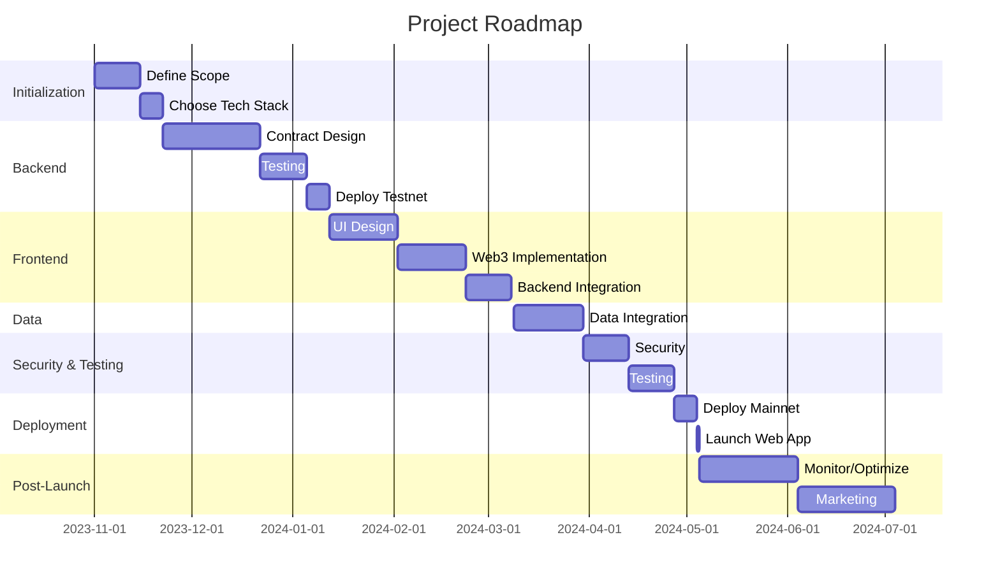
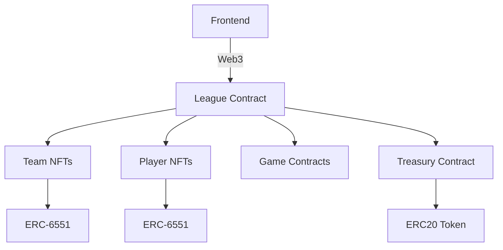

**Language > Specialist**: General > Project Planning and Architecture  
**Includes**: Mermaid for visualizing the project roadmap and architecture  
**Requirements**: Detailed roadmaps and Mermaid charts to clearly outline the steps and architecture.  

## Plan
1. Create a roadmap outlining the project milestones and timelines.
2. Create a Mermaid chart detailing the high-level architecture of the project.

Security is paramount, especially in a decentralized application where financial transactions are involved. Given the complexity and features you've outlined, it's essential to have a solid roadmap and architectural plan.

Here's how the roadmap might look:

### Roadmap

1. **Project Initialization**
    - Define project scope and objectives
    - Choose the tech stack
    
2. **Backend Development**
    - Smart Contract Design
        - League Contract
        - Team NFTs
        - Player NFTs
        - Game Contracts
        - Treasury Contract
    - Contract Testing
    - Contract Deployment (Testnet)
  
3. **Frontend Development**
    - User Interface Design
    - Implement Web3 functionalities
    - Integration with Backend
  
4. **Data Integration**
    - Choose and integrate data providers for real-world stats
  
5. **Security & Testing**
    - Implement security best practices
    - Conduct extensive testing
  
6. **Deployment**
    - Deploy smart contracts to Mainnet
    - Launch the web application
  
7. **Post-Launch**
    - Monitor and optimize
    - Marketing and user acquisition

Wha
